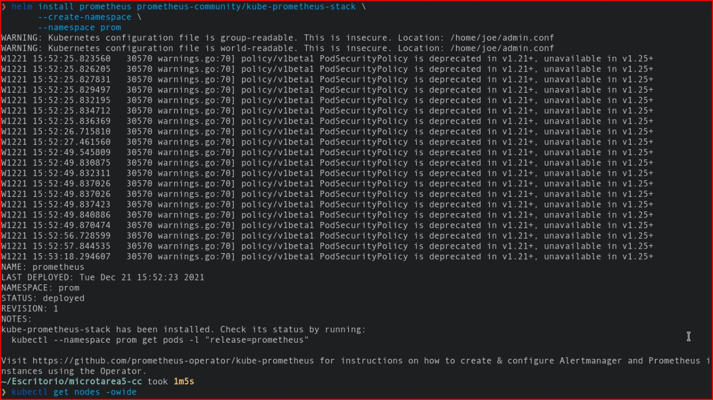
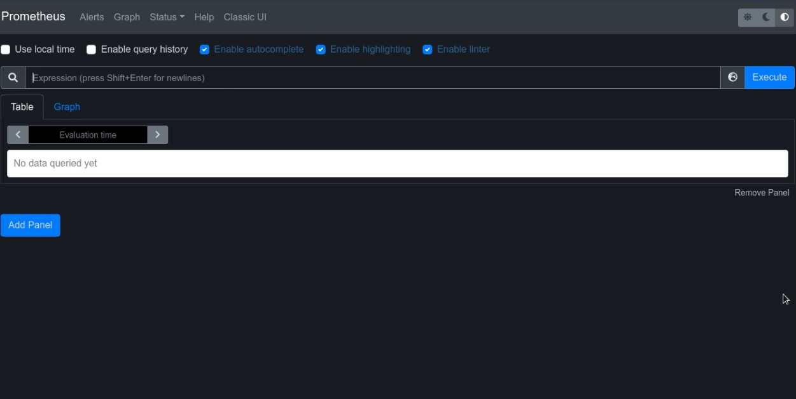
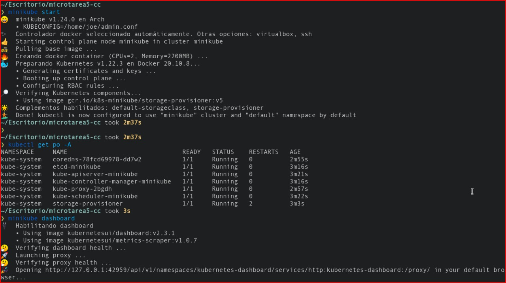
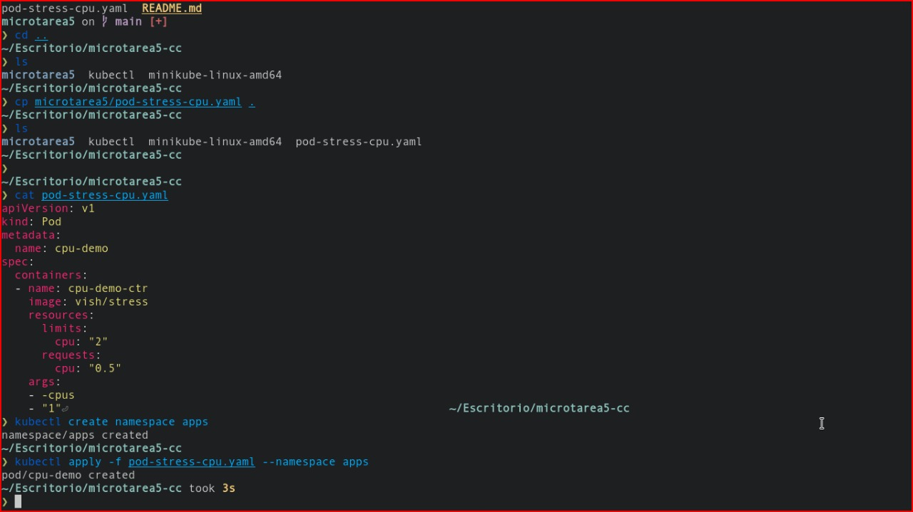
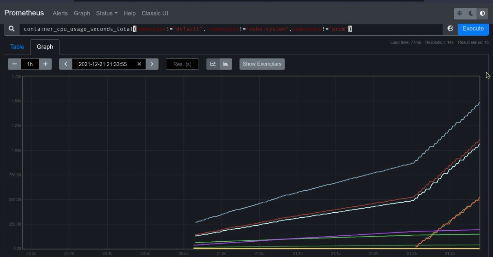
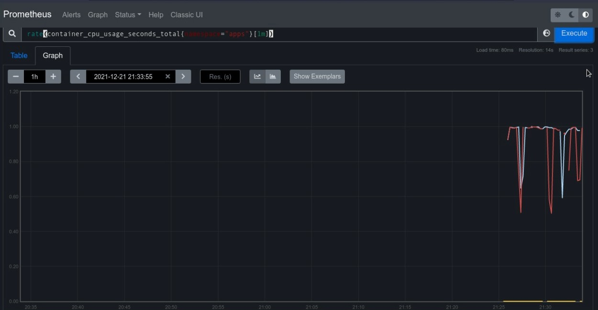
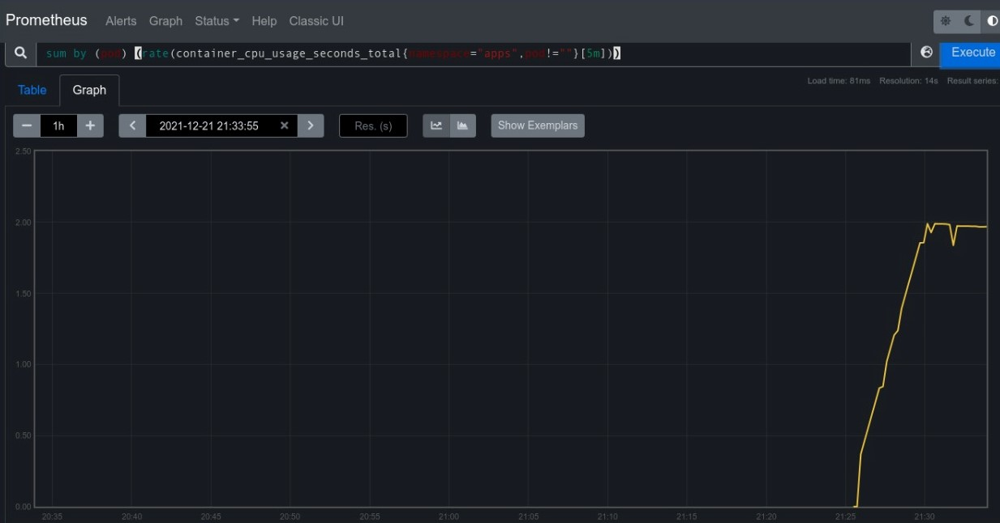

# Microtarea 5 - Cloud Computing (Bryan Diaz y Joe Acuña)

## Prometheus
Para el sistema de monitoreo se está utilizando prometheus, que está basado en tool kit en una base de datos de series temporales.

Para la instalación de Prometheus, por medio de helm, se ejecuta el siguiente comando para añadirlo al cluster. Para poder instalarlo tambíen tiene que estar prendido minikuve.
```
helm install prometheus prometheus-community/kube-prometheus-stack \
 --create-namespace \
 --namespace prom
```


Para visualizar el dashboard en el localhost


## Desplegando aplicación

Se tiene que genera un cluster minikube antes de todo. 


Para poner a prueba las consultas y visualizarlas con Prometheus, se generará un pod con 1 CPU.



## Monitoreo de métricas

En el dashboard de Prometheus se harán queries para visualizar el consumo que genera nuestra aplicación.

```
container_cpu_usage_seconds_total{namespace!="default", namespace!="kube-system",namespace!="prom"}

```



```
rate(container_cpu_usage_seconds_total{namespace="apps"}[1m])
```



```
sum by (pod) (rate(container_cpu_usage_seconds_total{namespace="apps",pod!=""}[5m]))
```



## Conclusiones

Como conclusión, Prometheus es una herramienta que nos permite monitorear las queries que queramos en nuestra aplicación de una manera sencilla.

### Integrantes 
- Joe Acuña
- Bryan Díaz
